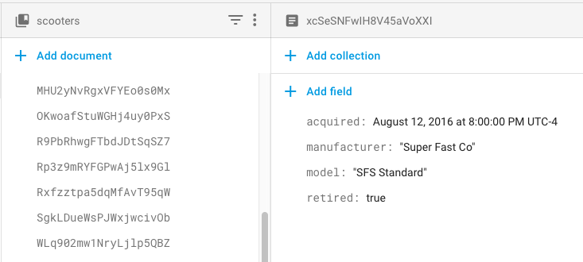
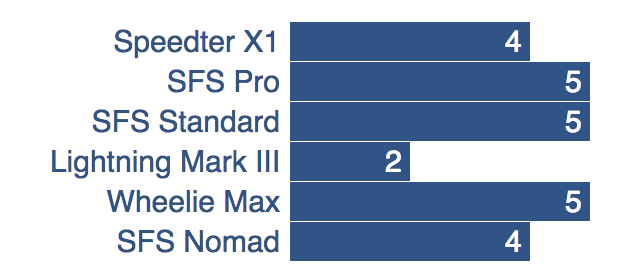
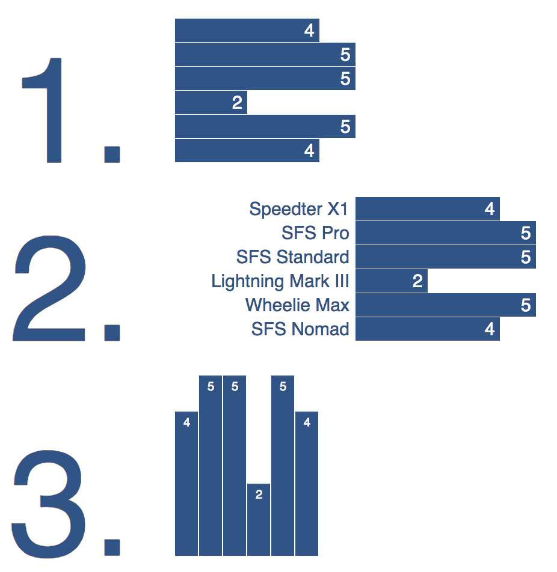

<style>
img {
    border: 1px solid #000;
}

.warning {
    background-color: yellow;
    color: #aa1122;
    font-weight: bold;
}

.hidden {
    display: none;
}

.hintButton {
    color: #7788ff;
    cursor: pointer;
}
</style>
<script>
document.addEventListener('DOMContentLoaded', hideHints);

function hideHints(evt) {
    document.querySelectorAll('.hint').forEach((ele, i) => {
        const div = document.createElement('div');
        div.id = 'hint' + i + 'Button';
        ele.id = 'hint' + i;
        ele.classList.add('hidden');
        div.addEventListener('click', onClick);
        div.textContent = 'Show Hint';
        div.className = 'hintButton';
        ele.parentNode.insertBefore(div, ele);
    });

}

function onClick(evt) {
    const hintId = this.id.replace('Button', '');
    const hint = document.getElementById(hintId);
    hint.classList.toggle('hidden');
    this.textContent = this.textConent === 'Show Hint' ? 'Hide Hint' : 'Show Hint';
}
</script>

# Firebase, D3 Lab - Simple Online Bar Graph (10 points for In-Class Project/Quiz Grade)

## Submission Process

* work in groups of 2 or 3
* __submit using [this form](https://docs.google.com/forms/d/e/1FAIpQLScVh8bQ7hjw83HQ0DIQcitwdUiMgLIgCDeaqs71DJ5tYYYiFg/viewform)__
* __each person on the team should submit their own individual form__

## Scoring

* __+5 points__ for showing up and submitting form 
* __+2 points__ import script: _reasonable_ amount of _valid looking_ code
* __+2 points__ data creation script: _reasonable_ amount of _valid looking_ code
* __+1 point__ (optional) going to url results in working visualization (bar graph/chart)

## Overview

### Goals / Topics Covered

You'll be using the following concepts:

* a cloud database (Firebase's Cloud Firestore)
* hosting a website (Firebase's Hosting)
* data visualization on the web (d3.js)

### Description

1. create a Cloud Firestore database
2. write a Python script to populate the database with data
	
3. create a webpage on Firebase's hosting
4. use d3 to display a bar graph showing the total number of models of scooters in the database 
	

## Instructions

### Part 1 - Create a Cloud Firestore database

Check out the [docs for getting started](https://firebase.google.com/docs/firestore/quickstart)

1. Go to the Firebase console
	1. Go to [the Firebase homepage at https://firebase.google.com/](https://firebase.google.com/).
	2. Click on the `GO TO CONSOLE` link on the upper right of the user interface.
	3. Create an account or sign in:
		* Create a _throw-away_ google account in incognito mode if you don't want any personally identifiable information saved with google (you don't have to fill in a phone number when prompted to do so)...
		* __Or__ sign in with your nyu google account.
2. Create a project
	1. Once you're in the console [https://console.firebase.google.com/](https://console.firebase.google.com/?pli=1), click on `Add project` (it's the button with a plus sign)
	2. Fill in the fields:
		* Project name: `scooter-inventory`
		* "Use the default settings...": uncheck
		* "I agree that I am using...": uncheck
		* Click on the `Continue` button
		* `Customize data sharing`: you can leave everything unchecked
		* After creating your project, you should be redirected to your project page
3. Create a database
	1. Click on `Develop` in the left-hand navigation bar (or in the hamburger menu)
	2. When the menu opens up, click on `Database`... 
	3. Click on `Create database`
	4. Switch to `Test Mode` (if you're not using this for testing, make sure to [read the docs on securing your database](https://firebase.google.com/docs/firestore/security/get-started)
	5. Click on `Enable`


### Part 2 - Populate the Database with Some Scooters!

1. Try manually creating some documents
	1. Click on `Add collection`
	2. In the `Collection ID` field, type in `scooters`
	3. Add the following fields... and fill in with any values:
		* `model`: a string
		* `manufacturer`: a string
		* `acquired`: a date
		* `retired`: a boolean
	4. Try creating another document, but create different keys - notice that it's ok to do this!
	5. Delete the second document
2. Install libraries that allow access to Firestore with Python 
    * `firebase-admin` - configuration, credentials, etc.
		* `pip3 install --upgrade firebase-admin`
		* `# or just pip if pip3 is unavailable`
		* `# you may need to use sudo`
	* you may need to install additional libraries if there's an error later on (for example, `google-cloud-firestore` which allows client access for create, read, etc. was not installed when this lab's reference solution was created, so it had to be installed manually)
3. Download a JSON certificate keyfile for authenticating
	* click on the gear icon in the left-hand navigation panel and then click on `Project settings`
	* click on the `Service accounts` tab
	* click on `Generate new private key`
	* download the file and keep note of its location
4. Authenticate and create a client
	* Create a new python file called `create.py`
	* Drop in the following code, substituting the correct path to your json keyfile
		<pre><code data-trim contenteditable># imports
import firebase_admin
from firebase_admin import credentials
from firebase_admin import firestore
</code></pre>
		<pre><code data-trim contenteditable># authenticate
cred = credentials.Certificate('/PATH/TO/KEYFILE.JSON')
default_app = firebase_admin.initialize_app(cred)
</code></pre>
		<pre><code data-trim contenteditable># create client
db = firestore.client()
print(db)
</code></pre>
	* Run your script to see if it prints something out (it should be the string representation of the client, like `<google.cloud.firestore_v1beta1.client.Client object at 0x10ac1ff98>`)
5. Create a document reference and use it to set some values; these will be saved to the database!
	* create a new document by create a document reference:
		<pre><code data-trim contenteditable>doc_ref = db.collection('scooters').document()
</code></pre>
	* add fields and values to this new document:
		<pre><code data-trim contenteditable>doc_ref.set({
    'field1': 'value1',
    'field2': someObj2
})
</code></pre>
	* use the `datetime` module to create a timestamp:
		<pre><code data-trim contenteditable>import datetime
new_date = datetime.datetime(2018, 3, 25),
</code></pre>
	* Run your script... 
	* Click on the `Database` link in the navigation to see if your new scooter is in the database!
6. Create __at least 25 scooters__ with randomized model names, retired, acquired and manufacturer values
	* __make sure that models and manufacturers remain consistent__
	* (for example, if a scooter that is model `foo` is made by manufacturer `bar`, if another scooter is model `foo`, it should also have manufacturer `bar`)
	* hint1: `random.choice([val1, val2, val3])` will give back a random element from the list passed in as the argument
	* hint2: its ok to create documents and set values within a loop


### Part 3 - Create a Webpage and Use the JavaScript Client 

__Note__ When you create a Cloud Firestore project, it also enables the API in the Cloud API Manager.

This means that you can use _client-side_ JavaScript (that is, JavaScript running in the browser) to access the data you have in Firestore.

Additionally, Firebase allows free hosting of static files (like html, images, etc.)

This is kind of a big deal: it basically allows you to build a _"serverless"_ web app that connects to a database in the cloud - can there be _any more buzzwords?_

In this part, we'll create a local HTML page and use the Firebase JavaScript client library to connect to the database.

1. Create a file called `index.html`
	* add the following code
	<pre><code data-trim contenteditable>&lt;!DOCTYPE html&gt;
&lt;head&gt;
&lt;title&gt;&lt;/title&gt;
&lt;/head&gt;
&lt;body&gt;
&lt;svg class="scooterChart"&gt;&lt;/svg&gt;
&lt;script src="https://www.gstatic.com/firebasejs/5.5.5/firebase-app.js"&gt;&lt;/script&gt; 
&lt;script src="https://www.gstatic.com/firebasejs/5.5.5/firebase-firestore.js"&gt;&lt;/script&gt;
&lt;script&gt;
&lt;/script&gt;
&lt;!-- your code goes here --&gt;
&lt;/body&gt;
&lt;/html&gt;
</code></pre>
	* note that it includes the firebase client side JavaScript library (we'll use these in the next step!)
2. Start writing JavaScript to connect to your database 
	* add the following code between the script tags in your html file:
		<pre><code data-trim contenteditable>firebase.initializeApp({
  apiKey: '',
  authDomain: '',
  projectId: ''
});
</code></pre>
		<pre><code data-trim contenteditable>// Initialize Cloud Firestore through Firebase
const db = firebase.firestore();
</code></pre>	
		<pre><code data-trim contenteditable>// Disable deprecated features
db.settings({
  timestampsInSnapshots: true
});
</code></pre>
3. Configure the JavaScript client
	* Click on `Authentication` on the left-hand navigation panel
	* Click on `Web setup` on the upper right of the user interface
	* Fill in `apiKey`, `authDomain`, and `projectId` appropriately based on the values in the modal dialog box `Add Firebase to your web app`
4. Get all of the scooters from the database:
	* use the code below to retrieve all of the documents in the `scooters` collection
		<pre><code data-trim contenteditable>db.collection("scooters").get().then((querySnapshot) => {
  querySnapshot.forEach((doc) => {
    let d = doc.data();
    console.log(d.manufacturer, d.model, d.acquired, d.retired);
  });
});
</code></pre>
	* the code within the outer curly braces (after `then`) runs once the data has been received
	* the next line loops over every document
	* ...so within the inner curly braces, you have access to each scooter by calling `.data()` on the document, `doc`
	* you can treat JavaScript objects like Python dictionaries
	* __except that you can also use a dot, `.`, to access values (not just []'s)__
	* `console.log` is similar to python's `print`
	* you can declare variables with `let varname = value`
	* `=>` are function declarations (kind of like `lambda`
5. open your `index.html` file with your browser
	* Go to `File` &rarr; `Open File`
	* browse to `index.html`
	* right click on the page, and select `Inspect`
	* click on `console` to see what gets printed out

	 

### Part 4 - D3

Include d3 by adding this tag underneath the script tags for firebase, but above the script tags that contain your code

```
<script src="https://d3js.org/d3.v5.js"></script>
```

* once you have the d3 included...
* figure out the number of each model of scooter that you have
* (for example, you may have 5 of one type, and 10 of two others... for a total of 25 scooters)
* hint 1: use JavaScript objects like python dictionaries to come up with counts
* hint 2: `Object.values(someObject)` will give you an `Array` of values (much like `.values` on a `dict`)
* hint 3: once you have the values, you can [use the notes](../d3/overview.html) to draw one of the following graphs:



### Part 5 (Optional) - Hosting and Deploy

Activate free hosting

* Click on `Hosting` on the left-hand navigation panel
* Click on `Get started`
* Follow on-screen instructions for deploying
	* (warning: requires node)
	* `npm install` required tools
	* `firebase login`
	* `firebase init`
	* `firebase deploy`
