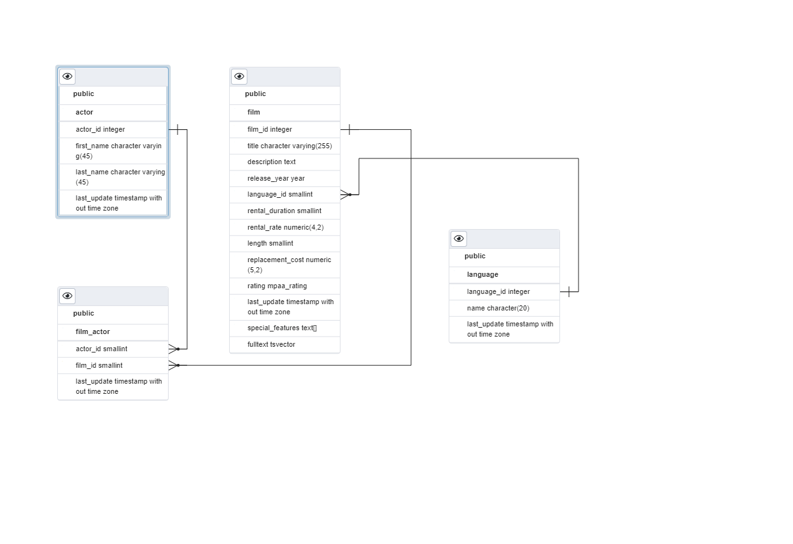

# In Class Quiz 3

## Dataset

This dataset is a subset of data from the [Sakila sample database](https://dev.mysql.com/doc/sakila/en/), and has been ported to several platforms. For the subset used in the quiz, the database was sourced from [postgrestutorial](https://dev.mysql.com/doc/sakila/en/). 

* The DVD rental database (yes, very much dated!) to be used for the quiz contains information about the business processes of a DVD rental store
* It originally had 15 tables related to DVD Rental.
* Some of the field types are types that we have not covered or custom types; there will not be any questions regarding concepts related to these types.
* The database was __reduced to 4 related tables__ to make it concise for the purpose of the quiz. 
* After dropping the other tables, the ER diagram below was regenerated and the modified database was saved 
* The tables retained are: film, language, actor, and film_actor.

## Restore

👀 __Restoring the database is completely optional__, as the ER diagram is more than adequate for answering multiple choice and fill-in-the-blank questions. However, if you would like to restore the database, you can follow these steps:

* create a new database `quiz03`
* uncompress the [zip file](../assignments/quiz03.zip)
* change to the directory that was extracted, `quiz03`
* run `psql` with a redirect: `psql quiz03 < restore.sql`
